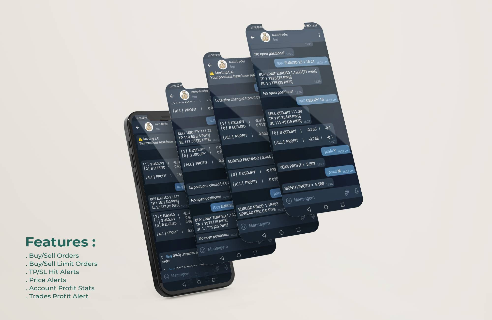

<center>
<h1>
 telegram-trader-bot
</h1>
</center>

This metatrader bot focused on Forex allows you to control your trades and receive alerts with simple commands through telegram in your mobile device. It's easy to use.

<br>



<br>

## Setup
> 1 - open `trader_bot.mq5` file with metaeditor  
> 2 - move include files to include folder on metaeditor  
> 3 - compile the file code   
> 4 - open the the compiled `trader_bot.ex5` file with metatrader  
> 5 - on navbar >> tools > options > expert advisor  
```
 allow algorithm trading
 allow web requests url
 add 'https://api.telegram.org' bellow
 click OK
```
> 6 - on sidebar click on Expert advisor > auto-trader  
> 7 - change the telegram BOT token and click OK  
> 8 - You're good to go now.

<br>

## Telegram bot commands
```
/buy (PAR) (stoploss_pips) - Buy order
/buy (PAR) (stoploss_pips) (RATE) (DURATION) - Buy limit order

/sell (PAR) (SL PIPS) - Sell order
/sell (PAR) (SL PIPS) (RATE) (DURATION) - Sell limit order

/list - List all open trades

/sl (nº de id em /list) (SL_RATE) - change stop loss
/close (nº de id em /list)/(ALL) - Close position(s)

/price (PAR) - Verify pair price and current spread
/alert (PAR) (PRICE) (DURAÇAO(MINS)) - Schedule price alert(pair)

/lote (LOTE SIZE) - change lote size
/profit (D/S/M/A/ALL) - Current profit

/version - Version and credits
/turn (ON/OFF) - Turn (on/off) supervised trades 
```